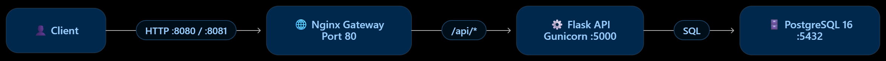

<div align="center">

# 🚀 ShopEase Order Service

### Containerized E-Commerce Order Tracking with Podman

A hands-on DevOps project demonstrating how to build, containerize, and deploy a multi-container order service using **Podman, Podman Compose, Nginx, Flask, PostgreSQL, and Kubernetes YAML**.

<br>


</div>

---

## 📌 Project Overview

**ShopEase Order Service** is a containerized e-commerce backend designed to demonstrate a practical DevOps deployment workflow.

The application consists of three components:

| Component | Technology | Responsibility |
|---|---|---|
| 🌐 Gateway | Nginx | Public entry point & reverse proxy |
| ⚙️ API | Flask + Gunicorn | REST API for order operations |
| 🗄️ Database | PostgreSQL 16 | Stores order information |

The project demonstrates how the **same container images** can be deployed using two different Podman execution models:

```text
Development  →  Podman Compose
Staging      →  Podman Pod + Kubernetes YAML
```
## 🏗️ Architecture



## 🔐 Network Flow
```text
                    Public Access
                         │
                         ▼
                 ┌───────────────┐
                 │  Nginx        │
                 │   Gateway     │
                 │    :80        │
                 └───────┬───────┘
                         │
                         ▼
                 ┌───────────────┐
                 │ Flask API     │
                 │ Gunicorn      │
                 │    :5000      │
                 └───────┬───────┘
                         │
                         ▼
                 ┌───────────────┐
                 │ PostgreSQL    │
                 │    :5432      │
                 └───────────────┘
```
🔒 Only the Nginx gateway is exposed to the host.
The Flask API and PostgreSQL database are not directly published.

## 🔄 Deployment Workflow
```text
        ┌─────────────────────┐
        │   Source Code       │
        └──────────┬──────────┘
                   │
                   ▼
        ┌─────────────────────┐
        │ Build Container     │
        │ Images              │
        └──────────┬──────────┘
                   │
          ┌────────┴────────┐
          │                 │
          ▼                 ▼
 ┌────────────────┐  ┌─────────────────┐
 │ Development    │  │ Staging         │
 │ Podman Compose │  │ Podman Pod      │
 └───────┬────────┘  └────────┬────────┘
         │                    │
         ▼                    ▼
     :8080                :8081
```

### 🧩 Two Deployment Models
| Environment | Deployment | Port | Networking |
|---|---|---:|---|
| 🧪 Development | Podman Compose | `8080` | Service-name DNS |
| 🚀 Staging | Podman Pod + K8s YAML | `8081` | Shared localhost |


## 🧠 Key Networking Concept
One of the main concepts demonstrated in this project is how container networking changes between Compose and Podman Pods.
### Podman Compose
```text
API → DB_HOST=db
Nginx → API_HOST=api
```
Containers communicate using their service names.
### Podman Pod
```text
API → DB_HOST=127.0.0.1
Nginx → API_HOST=127.0.0.1
```
Containers inside the same Pod share the same network namespace, allowing them to communicate through localhost.
```text
             Podman Pod
        ┌───────────────────────┐
        │                       │
        │  Nginx                │
        │    │                  │
        │    ▼                  │
        │  Flask API            │
        │    │                  │
        │    ▼                  │
        │  PostgreSQL           │
        │                       │
        └───────────────────────┘
```
## 📁 Project Structure
```text
shopease-orders/
│
├── 📂 app/
│   ├── Containerfile
│   ├── app.py
│   └── requirements.txt
│
├── 📂 db/
│   ├── Containerfile
│   └── init.sql
│
├── 📂 nginx/
│   ├── Containerfile
│   └── default.conf.template
│
├── 📂 kube/
│   └── order-pod.yaml
│
├── compose.yaml
└── README.md
```
## 🛠️ Technology Stack
| Category | Technology |
|---|---|
| Container Engine | Podman |
| Container Orchestration | Podman Compose |
| Pod Deployment | `podman kube play` |
| Reverse Proxy | Nginx |
| Backend | Python Flask |
| Application Server | Gunicorn |
| Database | PostgreSQL 16 |
| Configuration | Environment Variables |
| Deployment Definition | YAML |
| Container Build | Containerfile |
| API | REST |

## 🚀 Getting Started
### 1️⃣ Clone the Repository
```text
git clone https://github.com/SAI-GODGE/shopease-order-service.git
cd shopease-orders
```
### 📦 Build Container Images
Build the three application images:
```text
podman build -t localhost/shopease-order-db:1.0 ./db
podman build -t localhost/shopease-order-api:1.0 ./app
podman build -t localhost/shopease-gateway:1.0 ./nginx
```
Verify the images:
```text
podman images
```
### 🧪 Development Deployment
The development environment uses Podman Compose.
Start the complete application:
```text
podman-compose up -d --build
```
Check running containers:
```text
podman-compose ps
```
Expected architecture:
```text
Browser
   │
   ▼
localhost:8080
   │
   ▼
Nginx
   │
   ▼
Flask API
   │
   ▼
PostgreSQL
```

### 🔍 Verify the Application
Health Check
```text
curl http://localhost:8080/api/health
```
Expected response:
```text
{
  "database": "connected",
  "status": "ok"
}
```
List Orders
```text
curl http://localhost:8080/api/orders
```
Get a Specific Order
```text
curl http://localhost:8080/api/orders/1
```
### ➕ Create a New Order
```text
curl -X POST http://localhost:8080/api/orders -H "Content-Type: application/json" -d '{
  "customer": "Rahul Patil",
  "item": "Laptop Stand",
  "quantity": 1
}'
```
### 🔄 Update Order Status
```text
curl -X PATCH http://localhost:8080/api/orders/1 -H "Content-Type: application/json" -d '{
  "status": "DELIVERED"
}'
```
Supported order states:
```text
PLACED
   ↓
PACKED
   ↓
SHIPPED
   ↓
DELIVERED
```
## 📊 API Endpoints
| Method | Endpoint | Purpose |
|---|---|---|
| `GET` | `/api/health` | Check API & database health |
| `GET` | `/api/orders` | List all orders |
| `GET` | `/api/orders/<id>` | Get a specific order |
| `POST` | `/api/orders` | Create an order |
| `PATCH` | `/api/orders/<id>` | Update order status |


## 🔐 Container Security
The API container follows a non-root execution model.
```text
podman image inspect localhost/shopease-order-api:1.0 --format '{{.Config.User}}'
```
Expected:
```text
1001
```
The Flask application runs as a dedicated non-root user instead of running as root.
## 🚀 Staging Deployment with Podman Pod
The same container images can be deployed as a single Pod using Kubernetes-compatible YAML.

Start the staging environment:
```text
podman kube play kube/order-pod.yaml
```
Check the Pod:
```text
podman pod ps
```
Check containers inside the Pod:
```text
podman ps --pod --filter pod=shopease-orders
```
## 🌐 Test Staging Environment
The staging gateway runs on:
```text
http://localhost:8081
```
Health Check
```text
curl http://localhost:8081/api/health
```
List Orders
```text
curl http://localhost:8081/api/orders
```
## 🗄️ Verify PostgreSQL
Access the PostgreSQL container:
```text
podman exec -it shopease-orders-db psql -U shopease -d orders -c "SELECT * FROM orders;"
```
This verifies that the application is communicating with PostgreSQL successfully.
## 🔁 Replace the Pod
The staging deployment can be recreated from the YAML definition:
```text
podman kube play --replace kube/order-pod.yaml
```
Remove the staging Pod:
```text
podman kube down kube/order-pod.yaml
```
## 🧱 Container Design
Each application component has its own Containerfile.
```text
┌──────────────────────────────┐
│ Nginx Container              │
│ Reverse Proxy                │
└──────────────────────────────┘
┌──────────────────────────────┐
│ Flask Container              │
│ Gunicorn + REST API          │
│ Non-root user                │
└──────────────────────────────┘
┌──────────────────────────────┐
│ PostgreSQL Container         │
│ Database + Initialization    │
└──────────────────────────────┘
```
## ⚙️ DevOps Practices Demonstrated
### 🔹 Containerization
Each application component is packaged into an independent container image.
### 🔹 Reverse Proxy
Nginx acts as the single public entry point.
### 🔹 Environment-Based Configuration
Database and API hosts are configured using environment variables instead of hardcoded networking.
### 🔹 Non-Root Container
The Flask API runs using UID 1001.
### 🔹 Gunicorn
The Flask application is served using Gunicorn with multiple workers.
### 🔹 Image Reusability
The same images are reused between development and staging.
### 🔹 Kubernetes-Compatible Deployment
The application can be deployed as a Pod using:
podman kube play

## 🧪 Useful Troubleshooting Commands
View all containers
```text
podman ps -a
```
View logs
```text
podman logs shopease-api
podman logs shopease-gateway
```
View Compose logs
```text
podman-compose logs api
```
Inspect Pod
```text
podman pod inspect shopease-orders
```
Inspect images
```text
podman images
```
📸 Project Screenshots
Add your actual project screenshots here after uploading them to GitHub.

Application Health Check
/api/health

Order Listing
/api/orders

Podman Compose
podman-compose ps

Pod Deployment
podman pod ps

## 🎯 What I Learned
Through this project, I practiced:
- 🐳 Container image creation using Containerfiles
- 📦 Multi-container application deployment with Podman
- 🔗 Container-to-container networking
- 🌐 Nginx reverse proxy configuration
- ⚙️ Flask REST API development
- 🗄️ PostgreSQL containerization
- 🔐 Non-root container execution
- 🔧 Environment-based application configuration
- 🧩 Podman Compose
- ☸️ Kubernetes-compatible YAML
- 🚀 podman kube play
- 🔍 Application and container troubleshooting
- 🔄 Reusing the same images across deployment environments

## 💡 Important Project Concept
The main idea behind this project is:
Build once → Run in different environments

The application images remain the same while the runtime configuration changes depending on the deployment model.
```text
                 SAME IMAGES
                     │
          ┌──────────┴──────────┐
          │                     │
          ▼                     ▼
     Podman Compose         Podman Pod
      Development            Staging
          │                     │
          ▼                     ▼
        :8080                 :8081
```

This demonstrates an important DevOps principle of separating application images from runtime configuration.
## 🔮 Future Improvements
Possible extensions for this project:
- [ ] Add PostgreSQL persistent volumes
- [ ] Add automated CI/CD pipeline
- [ ] Push images to a container registry
- [ ] Add Prometheus monitoring
- [ ] Add Grafana dashboards
- [ ] Add centralized logging
- [ ] Add automated testing
- [ ] Add secrets management
- [ ] Deploy to Kubernetes/OpenShift
- [ ] Add HTTPS/TLS to the gateway
## ⭐ Project Highlights
```text
✅ Multi-container architecture
✅ Nginx reverse proxy
✅ Flask REST API
✅ PostgreSQL database
✅ Podman Containerfiles
✅ Podman Compose deployment
✅ Podman Pod deployment
✅ Kubernetes-compatible YAML
✅ Environment-based configuration
✅ Non-root application container
✅ API & database verification
```
👨‍💻 Author
<div align="center">
Saiprasad Godge
Cloud & DevOps Enthusiast
  
Building hands-on projects around:

Linux • AWS • Podman • Docker • Kubernetes • Ansible • CI/CD

</div>
